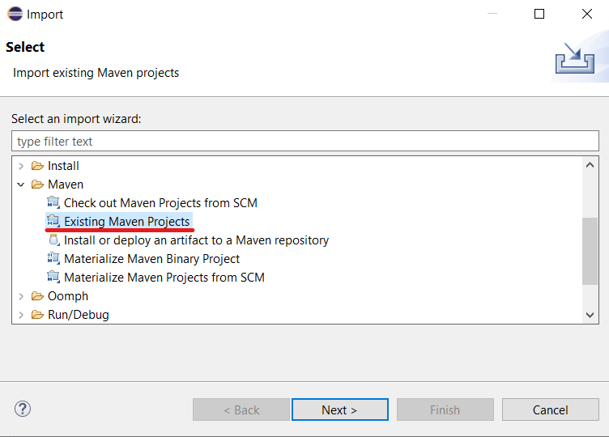
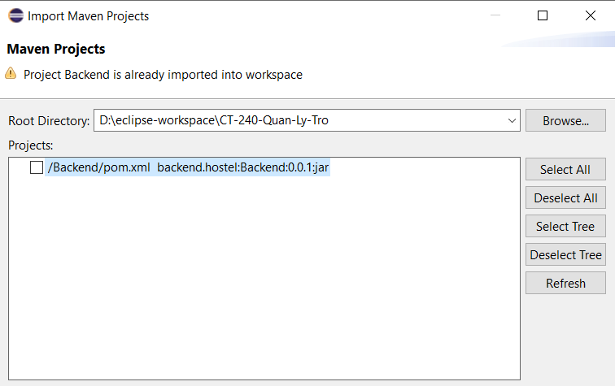
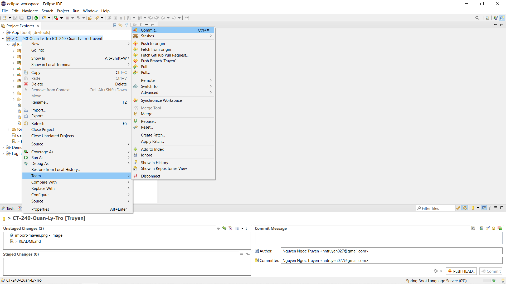
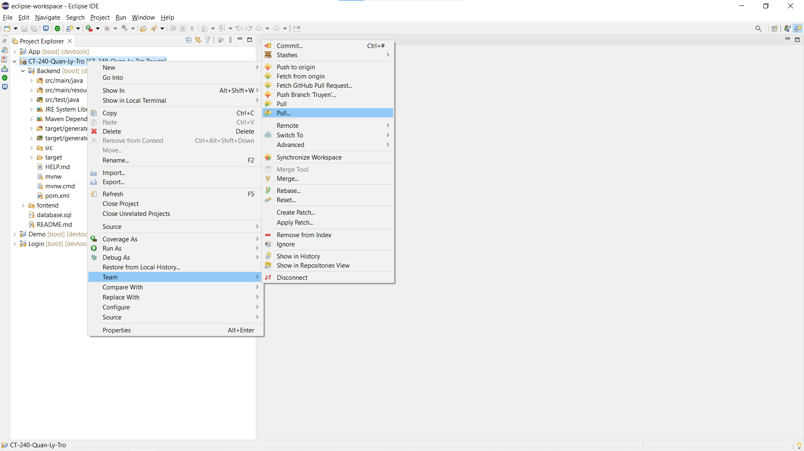

# Hệ thống quản lý trọ

## Thông tin cơ bản
- Hệ thống được xây dựng để phục vụ mục đích học tập. Đây là sản phẩm nhóm thuộc học phần Nguyên lý xây dựng phần mềm. Đây là hệ thống quản lý trọ sử dụng công nghệ giúp chủ trọ có thể quản lý các phòng ở, dịch vụ, khách hàng, tài chính của trọ thông qua một hệ thống duy nhất.
- Phần Server hệ thống được viết bằng ngôn ngữ Java, với sự hỗ trợ của Spring boot.
- Phần Frontend hệ thống được sự hỗ trợ của ReactJS.
- Phần Database sử dụng MySQL.


# Yêu cầu công nghệ

## Server
- Sử dụng trình soạn thảo code Java như Eclipse, NetBean, IntelliJ, Visual Studio Code.
- Có hỗ trợ công cụ quản lý và thiết lập tự động dự án Maven.
- Có hỗ trợ Spring Tools 4 hoặc các công cụ hỗ trợ cho dự án Spring boot.
- Sử dụng hệ quản trị cơ sở dữ liệu MySQL.

# Hướng dẫn sử dụng dự án
Trong hướng dẫn này sẽ sử dụng Eclipse

## Server

### Clone code từ github

* Mở terminal tại đường dẫn lưu trữ, nhập lệnh:
```git clone https://github.com/DoKyDuyenB2012188/CT-240-Quan-Ly-Tro.git```

* Mở IDE như Eclipse, Spring Tools...
- Vào file > Import > Maven > Existing Maven Projects


- Chọn đường dẫn lưu trữ Repo được clone về, tick vào phần project maven cần thêm (cụ thể là backend)


### Push code lên github

* Chuột phải vào project > Team > Commit... 


* Hộp thoại commit hiện ra > Thêm các thay đổi từ Unstaged Changes xuống Staged Changes > Nhập thông tin thay đổi vào Message > Commit and Push

### Pull code từ github

* Chuột phải vào project > Team > Pull... (Nên pull từ branch main)



